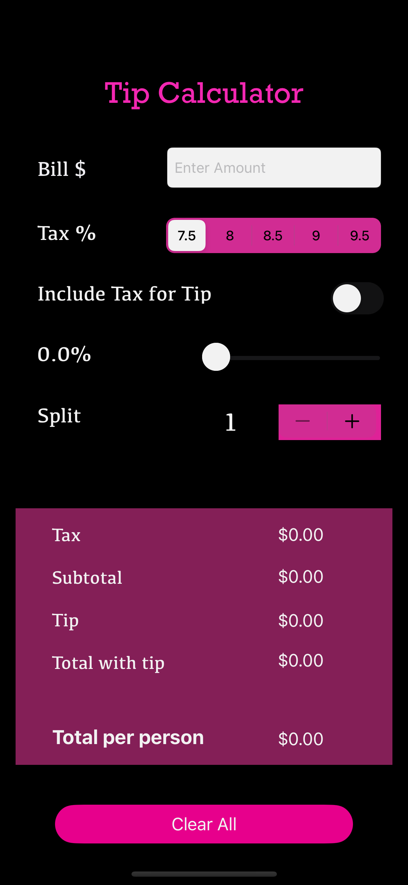
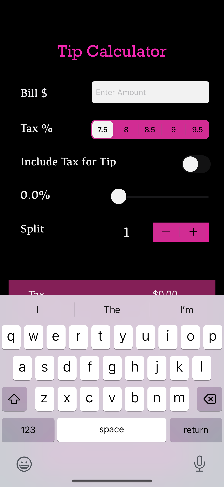
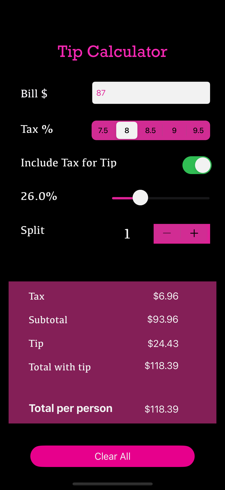
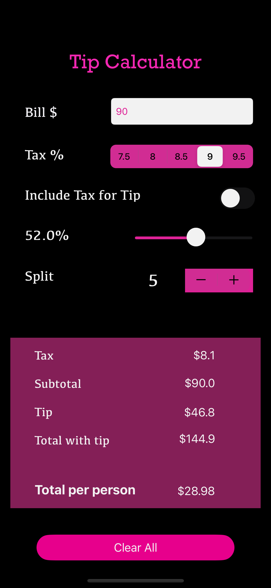
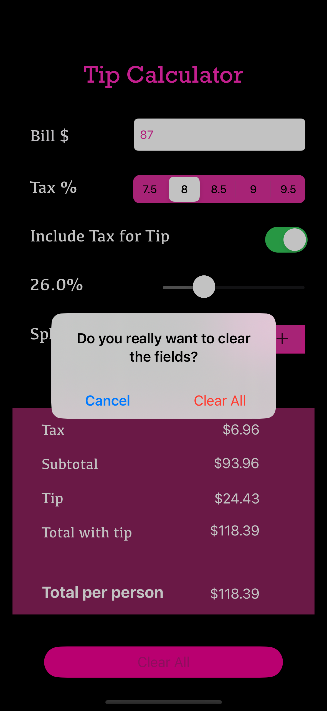

# Tip Split - iOS Tip Calculator App

## Overview
Tip Split is a basic tip calculator iPhone app written in Swift. The app allows users to enter a bill amount, select a tip percentage, specify if tax should be included, and divide the total tip amount evenly among a chosen number of people.

## Features
- User input for bill amount with decimal keyboard
- Segmented control to select tax percentage
- Switch to include or exclude tax from tip calculation
- Slider to adjust tip percentage
- Stepper to specify number of people to split tip between
- Output labels showing tax amount, subtotal, tip percentage, total tip, and per person tip amounts
- Reset button to clear all fields and start over
- Action sheet confirmation before resetting values
- AutoLayout constraints for proper UI across iPhone screens

## Technical Details
The app is built as a single view iOS application in Xcode using the Swift programming language. The user interface is designed in Storyboard with AutoLayout constraints.

The main technical components include:

- UI elements like UITextField, UISegmentedControl, UISwitch, UISlider, UIStepper, UILabels
- IBOutlets to connect UI elements to view controller
- IBActions triggered by component interactions like value changed or button tap
- Custom methods to handle calculations, reset values, and update UI
- Variables to store input values and calculation results
- Mathematical operations to calculate tax, subtotal, tip, total, and per person amounts
- Imported test classes to validate functionality and layout

## Getting Started
To run this project on your local machine:
1. Clone this repository
2. Open the project in Xcode
3. Build and run the app in iPhone simulator or connected device

## Usage
Using the app to calculate a tip amount:

- Enter bill amount in text field
- Select tax percentage from segmented control
- Toggle tax inclusion switch on or off
- Move slider to adjust tip percentage
- Use stepper to select number of people to split tip between
- Review calculated amounts updated in labels
- Tap **Clear All** button and confirm to start over

## Demo
### Default Screen 

### Insert Bill Amount 
a text field is activated when user wants to enter the bill amount

### Scenarios with Different Settings
 

### "Clear All" function

## Author
Cici Chang

